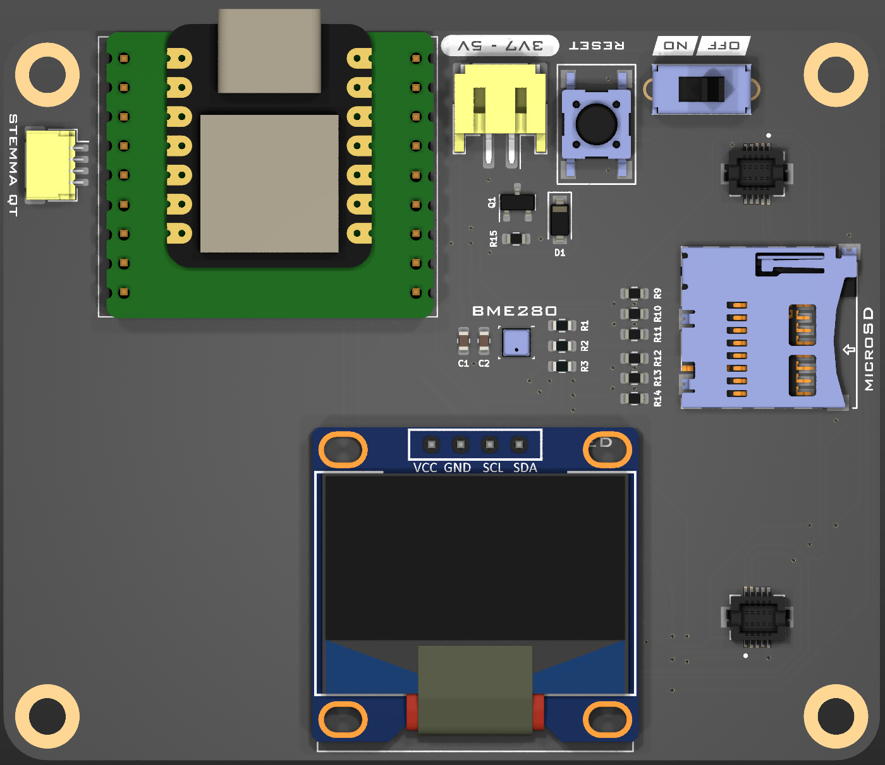
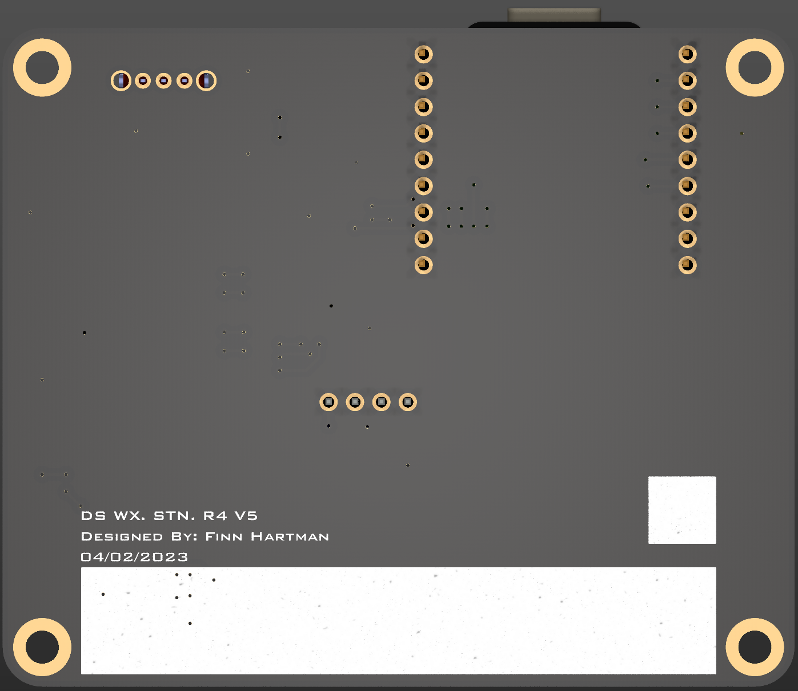
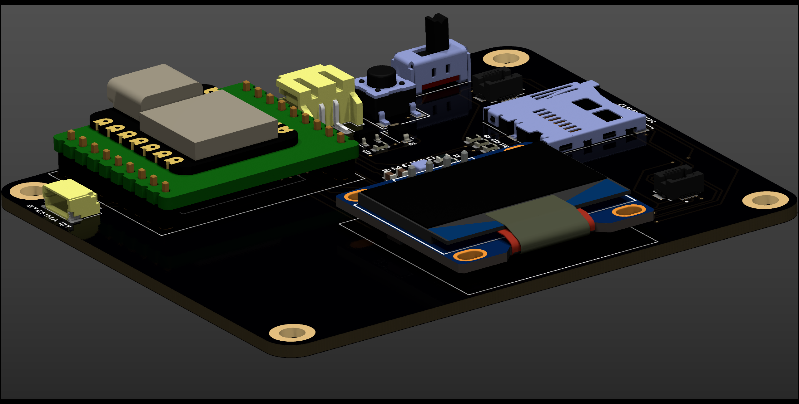
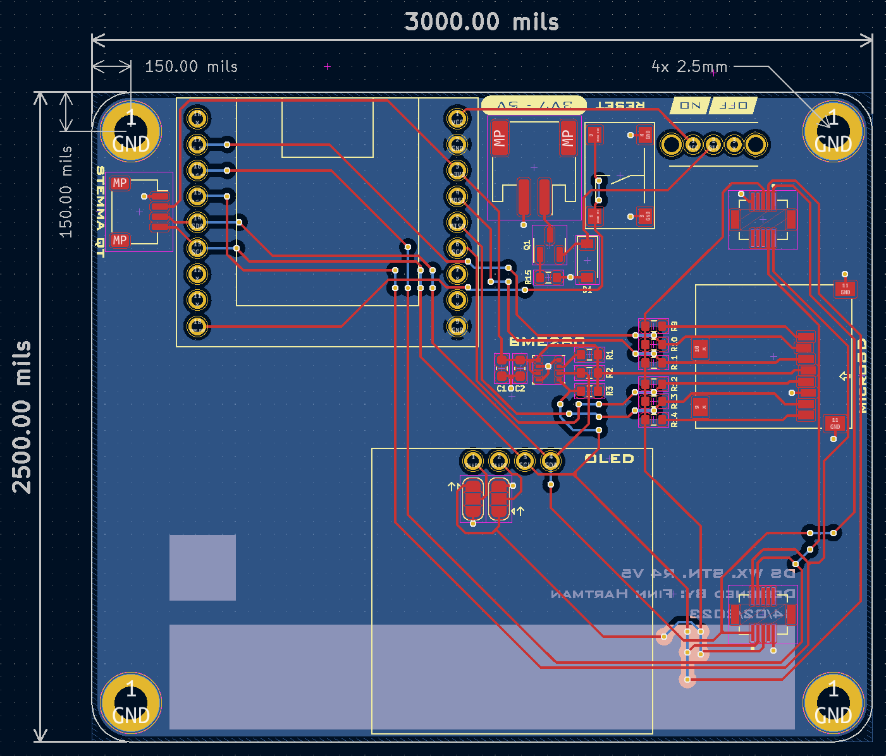

# Destination Weather Station R4 - Hardware
Hardware repository for the Destination Weather Station R4 remote sensing platform

## Features
- Seeeduino XIAO SAMD21 M0 microcontroller
- BME280 environmental sensor
- 128x64 OLED display
- microSD card connector
- STEMMA-QT connector
- Sensor Hat mezzanine connectors (reversable)

