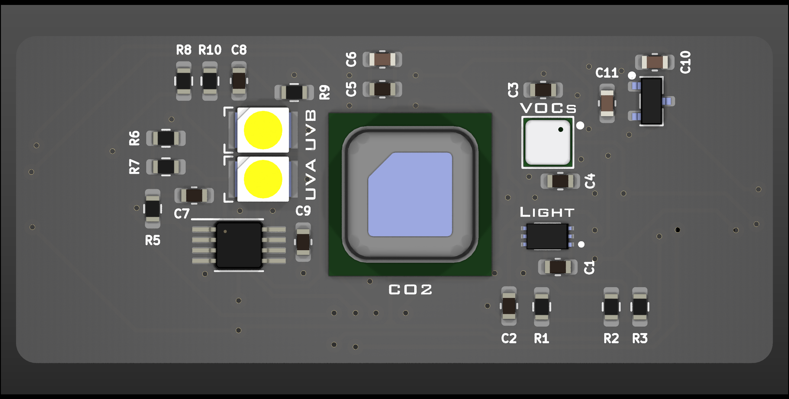
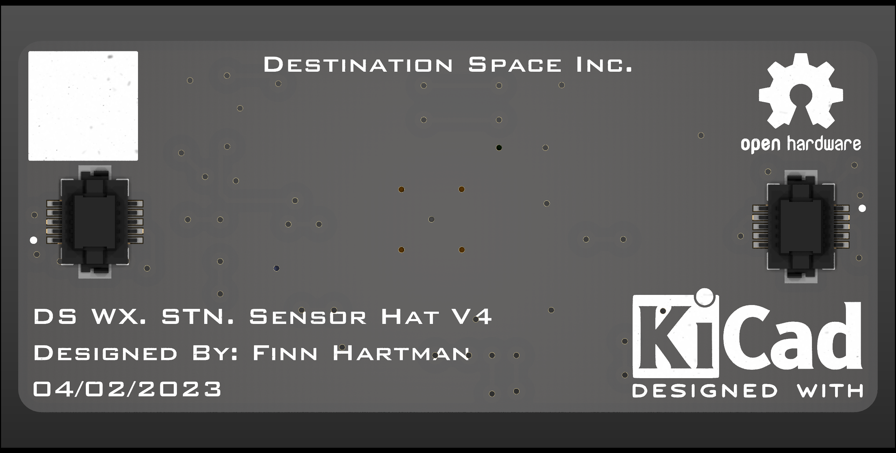
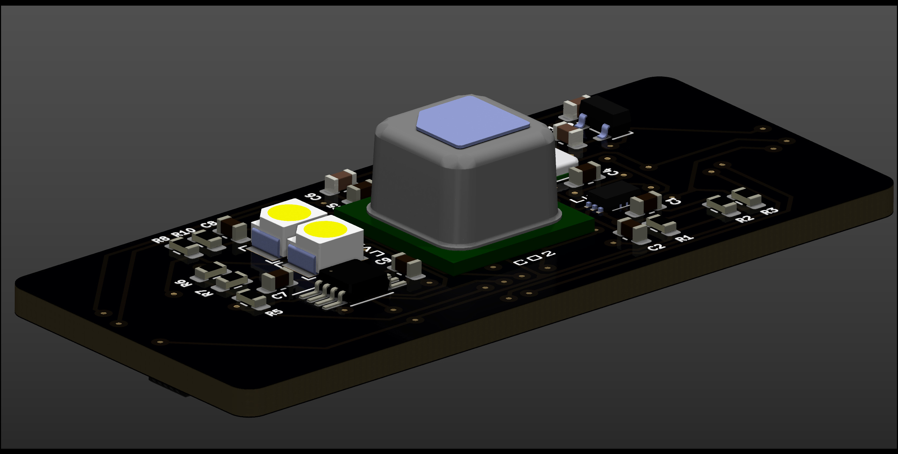
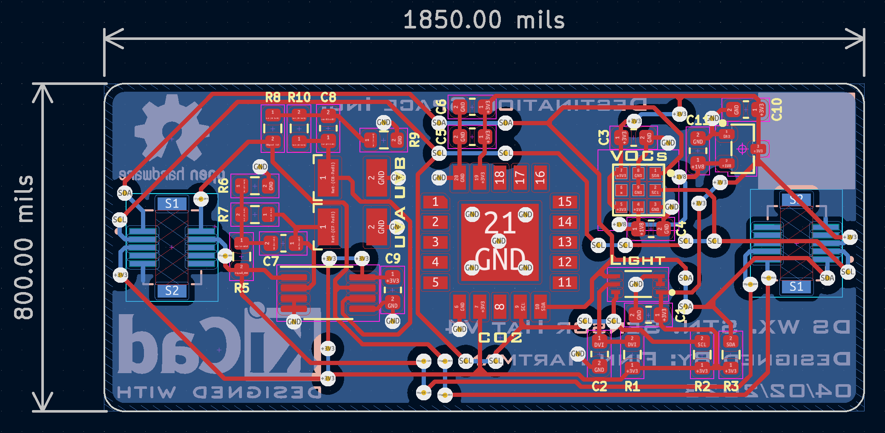

# Destination Weather Station Sensor Hat - Hardware

## Features
- SCD40 CO2 sensor
- ENS160 VOC & eCO2 sensor
- GUVA-S12SD UVA (350nm) sensor
- GUVB-S11SD UVB (300nm) sensor
- BH1750 ambient light sensor

